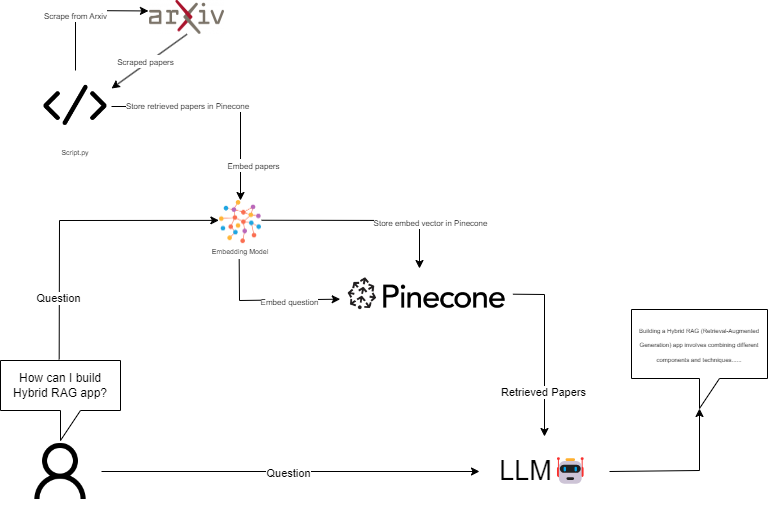

# Project Name: AskmeAboutRAG

We build one of the most self-awareness LLMs that known about itself in RAG.
With over 1,400 papers involved from arxiv in **"RAG"** category making our LLMs become a RAG Expert that know everything about RAG.

We deployed it on huggingface space with gradio interface. In this space we use LLama3 as a foundation model, You can try it now from the link below.

### Deployed Endpoint URL

https://huggingface.co/spaces/Supeem/Askme_About_RAG

### Project Video

https://www.youtube.com/watch?v=pBBGc7fE42U

### Team Members

[SupeemAFK](https://github.com/SupeemAFK), [microhum](https://github.com/microhum), [beambeambeam](https://github.com/beambeambeam), [GGital](https://github.com/GGital)
